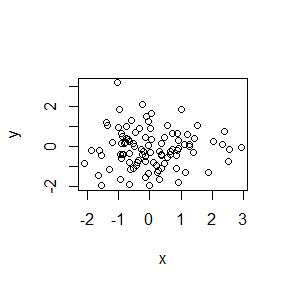

# cm004

# Level 1 header

## This is my header


This is a line of text

- bullet 1
- bullet 2


```r
x <- rnorm(100)
y <- rnorm(100)
plot(x,y)
```

<!-- -->

```r
summary(x)
```

```
##     Min.  1st Qu.   Median     Mean  3rd Qu.     Max. 
## -2.08100 -0.71440 -0.08076  0.04752  0.72930  2.93700
```


```r
x <- rnorm(100)
```


